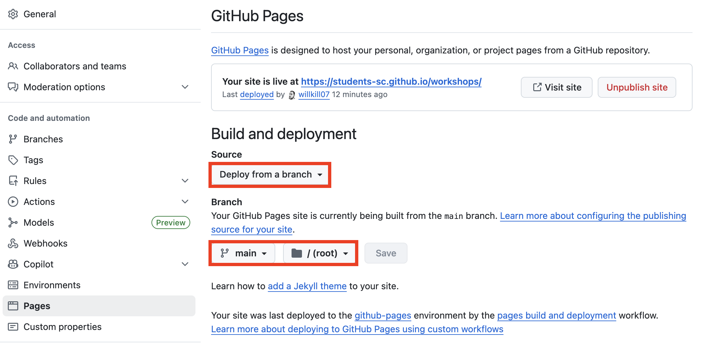

# Portfolio Cheat Sheet

## Checklist

### 1. Content & Communication
- ✅ Use clear, concise language throughout the portfolio
- ✅ Follow a consistent project structure
	- Problem → Solution → Tools → Results
- ✅ Highlight your personal contributions distinctly
- ✅ Use action verbs and measurable outcomes
	speedup, accuracy, scale

### 2. Project Selection & Depth
- ✅ Showcase 1-6 high-quality, relevant projects
    - depending on your experience and level of detail you want to include
- ✅ Include a mix of industry-relevant and research-level
- ✅ Prioritize originality, impact, and clarity over quantity

### 3. Structure & Navigation
- ✅ Use clear section headers:
	- About, Skills, Projects, Research, Contact
- ✅ Keep navigation simple and intuitive
- ✅ Ensure every project follows a repeatable, easy-to-read format
- ✅ Include an intro/homepage with name, tagline, and focus area

### 4. Skills, Tools, & Technologies
- ✅ List technical skills grouped by category
	- Languages, Frameworks, HPC Tools, etc.
- ✅ Match tools used to projects where relevant
- ✅ Mention level of proficiency or years of experience if useful

### 5. Results & Impact
- ✅ Include metrics wherever possible
- ✅ Visualize benchmarks or performance results
	- charts, graphs, tables
- ✅ Explain what the numbers mean in context
- ✅ Highlight collaboration, publication, or application outcomes

### 6. Visuals & Design
- ✅ Use visuals: diagrams, screenshots, figures to break up text
- ✅ Include descriptive captions and alt-text for all images
- ✅ Make sure layout is clean and mobile-responsive
- ✅ Use consistent fonts, spacing, and color scheme

### 7. Accessibility & Readability
- ✅ Use bullet points and short paragraphs for skimming
- ✅ Add alt-text to all graphics and figures for accessibility
- ✅ Test font sizes, contrast, and spacing on multiple devices
- ✅ Keep code examples syntax-highlighted and minimal

### 8. Hosting & Integration
- ✅ Host on a reliable platform
	- GitHub Pages, Notion, university website
- ✅ Include GitHub, LinkedIn, resume, and email prominently
- ✅ Link to external content with descriptive anchor text
	- repos, blogs, papers, demos

## Deploy with GitHub Pages

1. Create a new repository on GitHub
   - Name the repository `<username>.github.io` if you want to use your username as the domain
   - If you choose something else, then the website will be available at `https://<username>.github.io/<repository-name>`
2. Go to the repository settings and enable GitHub Pages
3. Clone the repository to your local machine
4. Create a new file in the repository
5. Commit the changes and push to GitHub
6. View the website!

> **Tip:**
> This website is hosted on GitHub Pages. You can look at the source code at [https://www.github.com/students-sc/workshops](https://www.github.com/students-sc/workshops)

### GitHub Pages Settings
<picture>
    <source media="(prefers-color-scheme: dark)" srcset="./static/github_dark.png">
    <source media="(prefers-color-scheme: light)" srcset="./static/github.png">
    
</picture>
